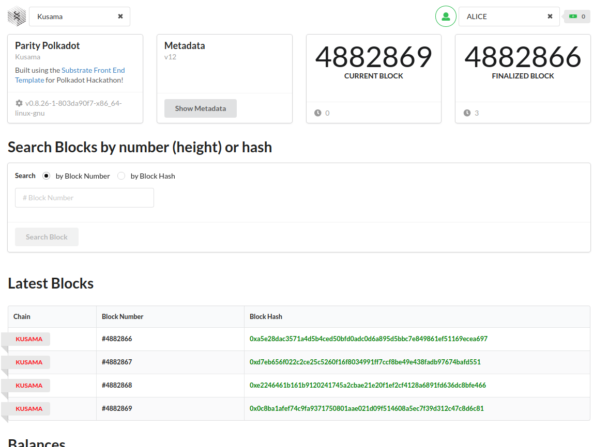

## [BEGINNER CHALLENGES] Front-End Javascript

### LIVE VERSION: https://sekmet.github.io/polkadot-frontend-js/

>Displays information about the latest block on *Kusama, Polkadot or any other Substrate-based chain. Include a component to search for a block by number (height) and/or hash.

SOURCE CODE: [https://github.com/sekmet/polkadot-frontend-js](https://github.com/sekmet/polkadot-frontend-js)
