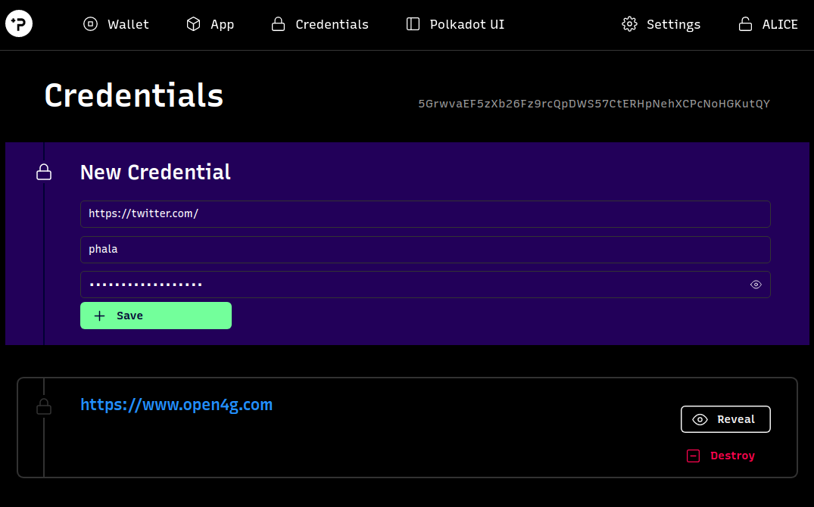

## Build the First Confidential Contract

Exploring how a confidential smart contract is made using @PhalaNetwork

I hacked helloworld and wallet dapps to create credentials/logins manager dapp! using phala network confidential contract!

### Repos
> https://github.com/sekmet/phala-blockchain/tree/helloworld

> https://github.com/sekmet/apps-ng/tree/helloworld

