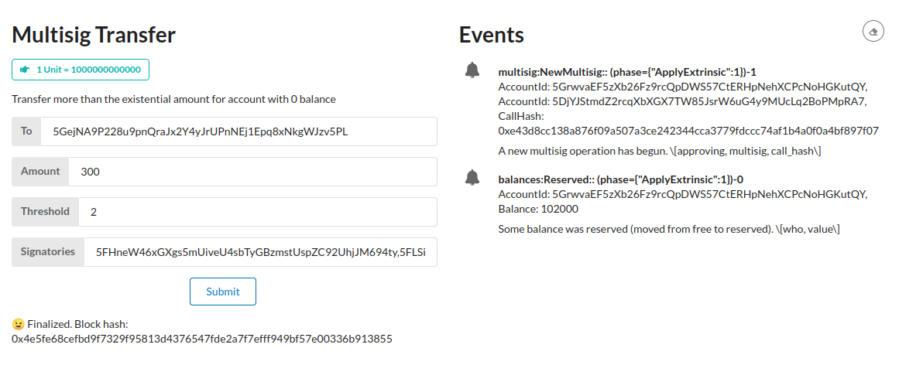

## [INTERMEDIATE CHALLENGE] FRAME Multisig

> Add the Multisig pallet to the Node Template and create a Polkadot-JS script to make a multisig transaction. Use the Front-End Template to create a multisig UI component.

